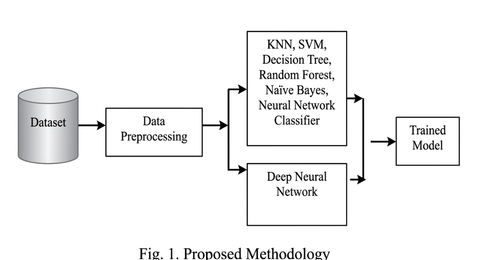
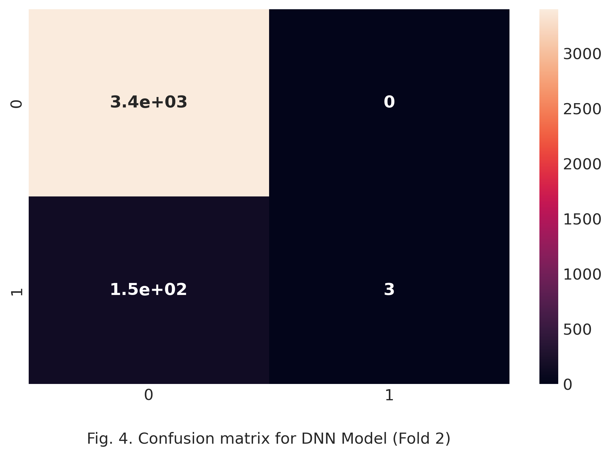
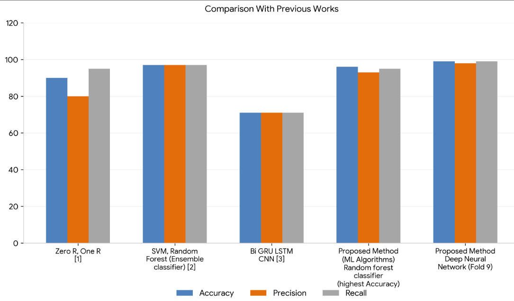

# Comparative Analysis of Deceptive Job Advertisement Prediction Using Data Mining

An advanced data science implementation evaluating traditional machine learning frameworks and deep learning topologies to proactively identify and mitigate online recruitment scam vectors.

---

## 📝 Project Abstract
With the rapid integration of electronic recruitment media into the global job market, malicious employment scams ("job scams") have drastically increased. These fraudulent activities explicitly target fresh graduates and students to steal critical personal, academic, financial, or tax information. 

This project implements and evaluates an automated multi-model classification system using **KNN, Decision Trees, Support Vector Machines (SVM), Naïve Bayes, Random Forest, Multilayer Perceptron (MLP), and Deep Neural Networks (DNN)**. Rather than relying on computationally heavy Natural Language Processing (NLP) or raw text processing, this model exclusively targets **7 categorical dimensions** extracted from the **Employment Scam Aegean Dataset (EMSCAD)** containing 18,000 samples. 

By eliminating the preprocessing overhead of unstructured text data, this architecture minimizes trainable parameters and training runtimes. Experimental evaluations prove that while conventional machine learning configurations show high precision, our dense **3-layer Deep Neural Network architecture achieves a peak validation accuracy of ~99% and a generalized mean of 97.7%**.

---

## 🔍 System Evolution Analysis

### ❌ The Existing Paradigm (Baseline Works)
Prior models analyzed recruitment security via traditional text analytics models like Online Recruitment Fraud (ORF) frameworks using classifiers such as Zero R, One R, and standard Logistic Regression.
* **Disadvantages:** Traditional architectures are highly susceptible to deceptive textual profiles designed by fraudsters to bypass standard linguistic rules, failing to dynamically flag emerging scam vectors. 
* **Baseline Accuracy:** Standard benchmarks peak at an **89.5% accuracy threshold** when running standard ensemble workflows on balanced text slices.

### 🚀 The Proposed Architecture
Our optimized methodology introduces a hyper-efficient data engineering lifecycle structured around three sequential stages: Data Pre-processing (removing noise and HTML tags), Feature Selection, and Hybrid Model Classification.

#### Key Engineering Advantages:
- **Dimensionality Reduction:** Restricts inputs to structural categorical features, avoiding resource-heavy tokenization or word-embedding loops.
- **Enhanced Security:** Successfully detects advanced financial fee traps, cash-in-hand mulling traps, and identity cloning schemes.

---

## 📊 Algorithmic Performance Benchmarks & System Diagrams

### 🔄 1. Proposed Methodology & Workflow
The system topology relies on isolating categorical feature nodes to cleanly separate authentic posts from fraudulent risks:



### ⚖️ 2. Classifier Evaluation Matrix
Below are the official comparative performance metrics compiled during the validation test phases ($80\%$ training, $20\%$ test split):

| Algorithmic Classifier Model | Accuracy (%) | Precision (%) | Recall (%) | F1-Score (%) |
| :--- | :---: | :---: | :---: | :---: |
| **Random Forest Classifier** | **96.5%** | 93.0% | 95.0% | 93.0% |
| **Decision Tree** | 96.2% | 93.0% | 95.0% | 93.0% |
| **Multilayer Perceptron (MLP)** | 96.0% | 94.0% | 95.0% | 93.0% |
| **K-Nearest Neighbor (KNN, $k=13$)** | 95.2% | 93.0% | 95.0% | 93.0% |
| **Support Vector Machine (RBF Kernel)** | 95.0% | 90.0% | 95.0% | 92.0% |
| **Naïve Bayes Classifier** | 91.35% | **95.0%** | **96.0%** | **95.0%** |

### 🧠 3. Deep Learning Paradigm (DNN) 10-Fold Validation
To combat structural class imbalances within real-world recruitment data, a 10-fold cross-validation scheme was introduced for the Deep Neural Network:
* **Architecture:** Sequential model comprising three dense structural hidden layers running a **ReLU** activation function, an adaptive learning **Adam** optimizer, and a calculated **Dropout layer** to eliminate over-fitting traps on training data.

The empirical breakdown across all ten training folds highlights the relationships between accuracy, precision, and recall metrics:

.png)

* **Peak Efficiency:** Validation accuracy metrics maxed out at **99.0%** during targeted cross-validation passes (specifically Folds 5 and 9).
* **Average Stability:** The global model maintained a steady **97.7% mean accuracy baseline** across all ten test partitions.

### 🎯 4. DNN Confusion Matrix
The mapping below shows the model's precise diagonal classification layout on unseen validation test records, confirming high statistical dependability:



---

## 📈 Global Benchmarking Comparison
The performance curves below visualize how our optimized categorical-only training strategy stacks up against text-based historical models (such as TextCNN at 66% and Bi-GRU-LSTM at 70%):



---

## 📉 Statistical Validation Formulas
The accuracy metrics within this repository are mathematically generated using industry-standard statistical boundaries to verify false-positive and false-negative weight distributions:

$$\text{Accuracy} = \frac{TP + TN}{TP + FP + FN + TN}$$

$$\text{Precision} = \frac{TP}{TP + FP}$$

$$\text{Recall} = \frac{TP}{TP + FN}$$

$$\text{F1-Score} = 2 \times \frac{\text{Recall} \times \text{Precision}}{\text{Recall} + \text{Precision}}$$

*(Where $TP$ = True Positives, $TN$ = True Negatives, $FP$ = False Positives, and $FN$ = False Negatives)*.

---

## 🛠️ System Requirements & Specifications

### Software Requirements
* **Operating System:** Microsoft Windows 10
* **Development Language:** Python
* **IDE / Tooling Environments:** PyCharm / Visual Studio Code
* **Local Database Engine:** SQLite

### Hardware Minimum Benchmarks
* **Processor (CPU):** Intel Core i3 Architecture
* **System Memory (RAM):** 8 GB Physical Allocation
* **Storage Matrix:** 1 TB Hard Disk Drive (HDD) Capacity
* **I/O Equipment:** 15'' LED Display Panel, Standard Keyboard & Mouse

---

  ---
  ## 📂 Repository Structure
```
├── .gitignore             <-- Critical: Automatically ignores local database and caches
├── README.md              <-- Project documentation
├── requirements.txt       <-- Python dependencies (Django, Scikit-learn, Pandas, etc.)
└── src/                   <-- Central source code folder
    ├── manage.py          <-- Django management script
    ├── db.sqlite3         <-- Local database file (Ignored in production via .gitignore)
    ├── FakeJobPosting/    <-- Core Django project configuration folder
    │   ├── __init__.py
    │   ├── settings.py    <-- Project settings & middleware configurations
    │   ├── urls.py        <-- Main routing configurations
    │   └── wsgi.py        <-- Deployment application interface
    ├── admins/            <-- Django App for Admin functionalities & classification dashboards
    ├── users/             <-- Django App for Candidate portal & authentication
    ├── assets/            <-- Static UI files (CSS, Javascript, System Assets)
    └── media/             <-- Directory managing dynamic system file uploads
```
---
